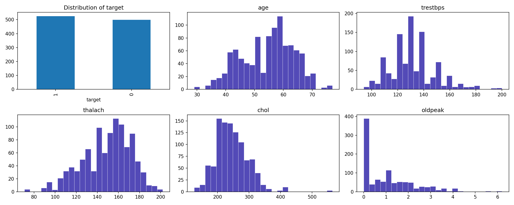
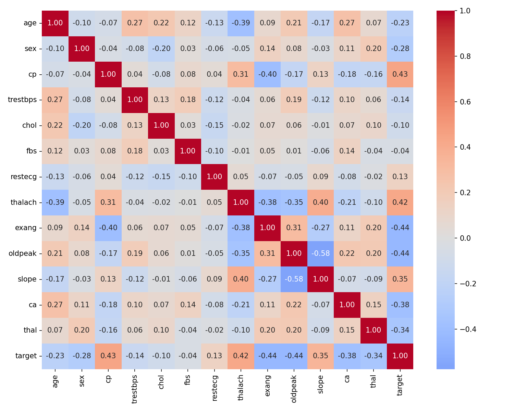
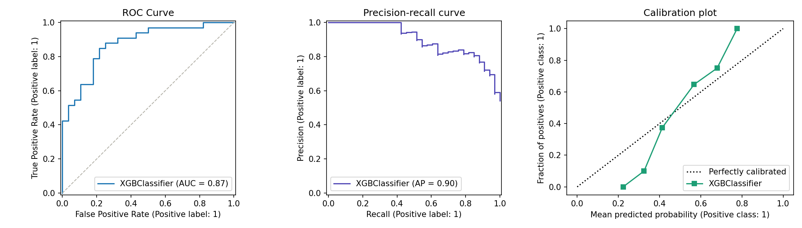
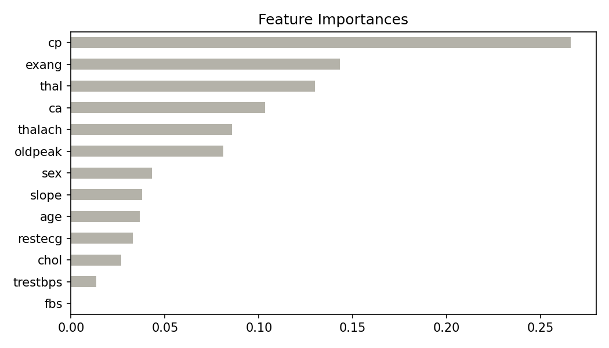

# Getting Started
```bash
git clone https://github.com/tleopardt/heart-disease-eval-report.git
cd heart-disease-eval-report
python3 -m venv venv
source venv/bin/activate
pip install -r requirements.txt

python3 optuna-tuning/run.py
python3 heart-disease-prediction/run.py
```

# Heart disease prediction

## Dataset
- Source: Heart Disease Dataset
- Original records: 1,025
- Duplicate records: 723
- Unique records after cleaning: 302
- Features: 13 clinical features
- Target: Heart disease (0/1)

## Project Structure
python/
├── heart-disease-prediction/
    └── run.py
├── optuna-tuning/
    ├──test
        └── run.py
    └── test-model.py
├── .gitignore
├── model_tuned.pkl
├── README.md
└── requirements.txt

## Methodology

```text
Raw Dataset (1,025 rows)
        ↓
Data Cleaning
- Handle missing values
- Fix data types
- Remove 723 duplicate records
        ↓
Exploratory Data Analysis (EDA)
- Feature distributions
- Correlation heatmap
- Target distribution
        ↓
Feature Analysis
- XGBoost feature importance
- Identify key predictors
        ↓
Hyperparameter Tuning
- Optuna optimization
- 5-fold cross validation
        ↓
Model Evaluation
- Logistic Regression
- Random Forest
- XGBoost
- AUC & F1 comparison
        ↓
Error Analysis
- False Positive analysis
- False Negative analysis
- Identify difficult patient profiles
```

## Results
Predicts presence of heart disease using clinical features.
**Best model:** XGBoost (Optuna-tuned) — 0.9174.

| Model                   | AUC (5-fold CV)  | F1               |
|-------------------------|------------------|------------------|
| XGBoost (Optuna tuned)  | 0.919 ± 0.017    | 0.850 ± 0.044    |
| Random Forest           | 0.909 ± 0.018    | 0.836 ± 0.046    |
| Logistic Regression     | 0.905 ± 0.018    | 0.845 ± 0.036    |


## Key findings
Found 723 duplicates data and 303 unique data. Removing the duplicates reduced data leakage risk during cross validation
produce a more realistic model evaluation.





### The most important feature and why
The chest pain type `(cp)` feature contributed the most to the model because it provided the strongest signal for distinguishing patients with and without heart disease.


### Where the model still fails
**Failure summary between 3 models:**

| Model                   | FP               | FN               | Total Errors     |
|-------------------------|------------------|------------------|------------------|
| Logistic Regression.    | 7                | 5                | 12               |
| Random Forest           | 7                | 7                | 14               |
| XGBoost                 | 9                | 4                | 13               |

**False Negative & False Positive**
The model struggles to classify patients whose clinical indicators appear close to the healthy group. Most false-negative cases have low chest-pain scores `(cp=0)` and low vessel counts `(ca)`, making them difficult to distinguish from healthy patients.

```
             FN      FP  Dataset
age      60.000  57.556   54.421
ca        0.750   0.667    0.719
cp        0.000   1.778    0.964
oldpeak   0.675   1.400    1.043
```

# Skills demonstrated
Python · EDA · Statistical feature selection · Scikit-learn pipelines ·
XGBoost · Optuna · Model evaluation · Calibration